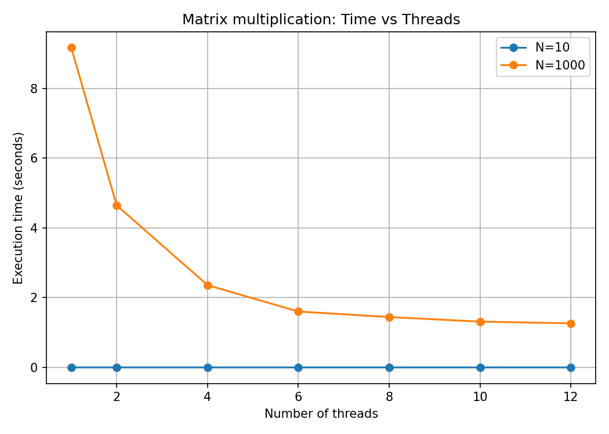
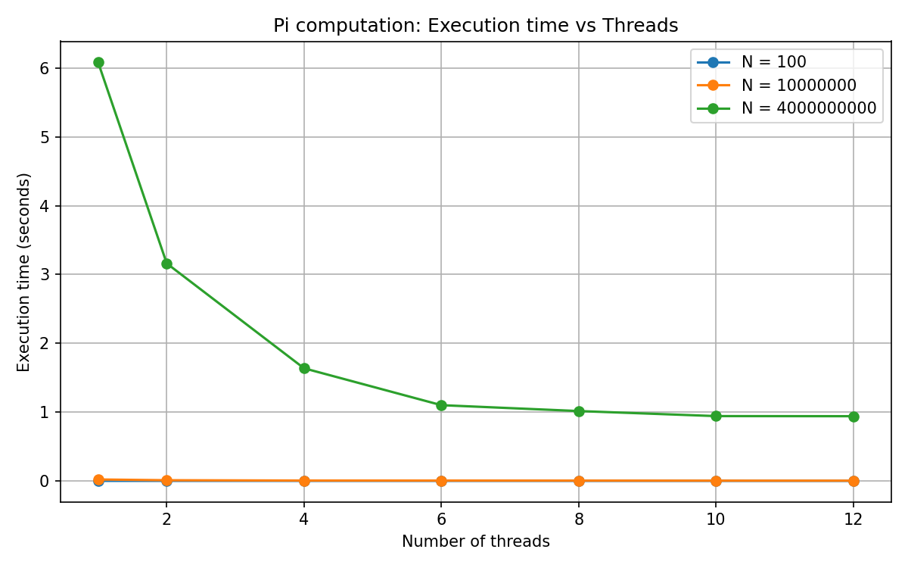
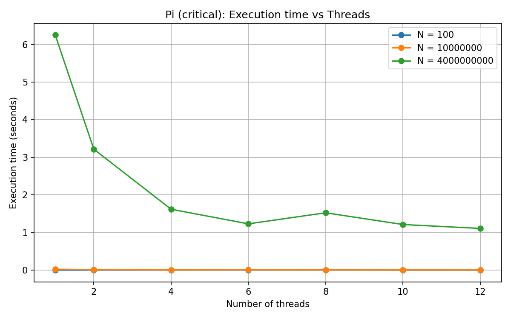

# ChuvSU Parallel Programming

Репозиторий для заданий по параллельному программированию.

## Сборка task2.cpp

Для сборки и запуска `task2.cpp` используйте следующие команды:

```bash
g++-15 -std=c++17 -fopenmp task2.cpp -o task2
./task2
```

## Сборка task3_1.cpp

Для сборки и запуска `task3_1.cpp` используйте следующие команды:

```bash
g++-15 -std=c++20 -fopenmp task3_1.cpp -o task3_1
./task3_1
```

## Сборка task3_2.cpp

Для сборки и запуска `task3_2.cpp` используйте следующие команды:

```bash
g++-15 -std=c++20 -fopenmp task3_2.cpp -o task3_2
./task3_2
```

## Сборка task4.cpp

Для сборки и запуска `task4.cpp` используйте следующие команды:

```bash
g++-15 -std=c++20 -fopenmp task4.cpp -o task4
./task4
```

## Сборка task5.cpp

Для сборки и запуска `task5.cpp` используйте следующие команды:

```bash
g++-15 -std=c++20 -fopenmp task5.cpp -o task5
./task5
```

**Пример выполнения:**

Input:
```
10
1000
```

Output:
```
[1]: Sum = 49600
[9]: Sum = 50400
[4]: Sum = 49900
[6]: Sum = 50100
[3]: Sum = 49800
[2]: Sum = 49700
[8]: Sum = 50300
[0]: Sum = 50500
[7]: Sum = 50200
[5]: Sum = 50000
Sum = 500500
```

## Сборка task6.cpp

Для сборки и запуска `task6.cpp` используйте следующие команды:

```bash
g++-15 -std=c++20 -fopenmp task6.cpp -o task6
./task6
```

**Пример выполнения:**

Input:
```
10
1000
```

Output:
```
[6]: Sum = 65050
[1]: Sum = 15050
[2]: Sum = 25050
[4]: Sum = 45050
[3]: Sum = 35050
[5]: Sum = 55050
[7]: Sum = 75050
[0]: Sum = 5050
[8]: Sum = 85050
[9]: Sum = 95050
Sum = 500500
```

## Сборка task7.cpp

Для сборки и запуска `task7.cpp` используйте следующие команды:

```bash
g++-15 -std=c++20 -fopenmp task7.cpp -o task7
./task7
```

**Пример выполнения (schedule(static, 2)):**

Input:
```
4
10
```

Output:
```
thread [1]: calculation of the iteration number <3>
thread [1]: calculation of the iteration number <4>
thread [2]: calculation of the iteration number <5>
thread [2]: calculation of the iteration number <6>
thread [3]: calculation of the iteration number <7>
thread [3]: calculation of the iteration number <8>
thread [0]: calculation of the iteration number <1>
thread [0]: calculation of the iteration number <2>
thread [0]: calculation of the iteration number <9>
thread [0]: calculation of the iteration number <10>
[1]: Sum = 7
[0]: Sum = 22
[2]: Sum = 11
[3]: Sum = 15
Sum = 55
```

**Распределение итераций по потокам для разных типов schedule:**

| Номер итерации | static | static, 1 | static, 2 | dynamic | dynamic, 2 | guided | guided, 2 |
|---------------:|-------:|----------:|----------:|--------:|-----------:|-------:|----------:|
| 1  | 0 | 0 | 0 | 2 | 1 | 1 | 2 |
| 2  | 0 | 1 | 0 | 1 | 1 | 1 | 2 |
| 3  | 0 | 2 | 1 | 0 | 0 | 1 | 2 |
| 4  | 1 | 3 | 1 | 3 | 0 | 0 | 0 |
| 5  | 1 | 0 | 2 | 2 | 2 | 0 | 0 |
| 6  | 1 | 1 | 2 | 2 | 2 | 2 | 1 |
| 7  | 2 | 2 | 3 | 2 | 3 | 2 | 1 |
| 8  | 2 | 3 | 3 | 2 | 3 | 3 | 3 |
| 9  | 3 | 0 | 0 | 0 | 1 | 1 | 3 |
| 10 | 3 | 1 | 0 | 0 | 1 | 1 | 2 |

## Сборка task8.cpp

Для сборки и запуска `task8.cpp` используйте следующие команды:

```bash
g++-15 -std=c++20 -fopenmp task8.cpp -o task8
./task8
```

**Пример выполнения:**

Input:
```
1000000
```

Output:
```
[3]: Part of pi = 0.628318130718177
[1]: Part of pi = 0.6283189307181617
[2]: Part of pi = 0.6283185307183825
[0]: Part of pi = 0.6283193307175647
[4]: Part of pi = 0.6283177307175769
Pi = 3.1415926535898633
```

## Сборка task9.cpp

Для сборки и запуска `task9.cpp` используйте следующие команды:

```bash
g++-15 -std=c++20 -fopenmp task9.cpp -o task9
./task9
```

**Пример выполнения:**

Input:
```
2
1 3
4 8
5 4
3 0
```

Output:
```
14 4
44 16
```

## Сборка task9_test.cpp (сравнение скорости умножения матриц: без/с распараллеливанием циклов)

Для сборки и запуска `task9_test.cpp` используйте следующие команды:

```bash
g++-15 -std=c++20 -fopenmp task9_test.cpp -o task9_test
./task9_test
```

**Пример выполнения:**

Input:
```
1000
```

Output:
```
serial: 8.88607 sec
parallel: 1.91855 sec
OK
```

## Сборка task10.cpp

Для сборки и запуска `task10.cpp` используйте следующие команды:

```bash
g++-15 -std=c++20 -fopenmp task10.cpp -o task10
./task10
```

**Примеры выполнения:**

Input: `2`
```
[0]: came in section 1
[0]: came in section 3
[1]: came in section 2
[0]: parallel region
[1]: parallel region
```

Input: `3`
```
[1]: came in section 1
[0]: came in section 2
[2]: came in section 3
[1]: parallel region
[0]: parallel region
[2]: parallel region
```

Input: `4`
```
[2]: came in section 1
[1]: came in section 2
[0]: came in section 3
[1]: parallel region
[0]: parallel region
[2]: parallel region
[3]: parallel region
```

## Сборка task11.cpp

Для сборки и запуска `task11.cpp` используйте следующие команды:

```bash
g++-15 -std=c++20 -fopenmp task11.cpp -o task11
./task11
```

**Пример выполнения:**

Input:
```
10
1000
```

Output:
```
[2]: Sum = 25050
[3]: Sum = 35050
[1]: Sum = 15050
[5]: Sum = 55050
[6]: Sum = 65050
[4]: Sum = 45050
[7]: Sum = 75050
[8]: Sum = 85050
[0]: Sum = 5050
[9]: Sum = 95050
Sum = 500500
```

## Сборка task12.cpp

Для сборки и запуска `task12.cpp` используйте следующие команды:

```bash
g++-15 -std=c++20 -fopenmp task12.cpp -o task12
./task12
```

**Пример выполнения:**

Input:
```
1000000
```

Output:
```
[0]: Part of pi = 0.6283193307175647
[2]: Part of pi = 0.6283185307183825
[1]: Part of pi = 0.6283189307181617
[3]: Part of pi = 0.628318130718177
[4]: Part of pi = 0.6283177307175769
Pi = 3.1415926535898624
```

## Сборка task12

### Эксперимент 1: Зависимость времени выполнения от количества потоков 9 задание

**Сборка и запуск C++ программы:**

```bash
cd task13/exp_task9
g++-15 -std=c++20 -fopenmp task13.cpp -o task13
./task13
```

**Создание виртуального окружения и установка зависимостей для Python:**

```bash
cd task13/exp_task9
python3 -m venv venv
source venv/bin/activate
pip install matplotlib
```

**Запуск Python скрипта для визуализации:**

```bash
python3 task13.py
```

**Результаты эксперимента:**

| N    | threads | time_sec  |
|------|---------|-----------|
| 10   | 1       | 0.000032  |
| 10   | 2       | 0.000063  |
| 10   | 4       | 0.000059  |
| 10   | 6       | 0.000090  |
| 10   | 8       | 0.000120  |
| 10   | 10      | 0.000110  |
| 10   | 12      | 0.000116  |
| 1000 | 1       | 9.170669  |
| 1000 | 2       | 4.646437  |
| 1000 | 4       | 2.359196  |
| 1000 | 6       | 1.602464  |
| 1000 | 8       | 1.443928  |
| 1000 | 10      | 1.312690  |
| 1000 | 12      | 1.264909  |

**График зависимости времени выполнения от количества потоков:**



### Эксперимент 2: Зависимость времени выполнения от количества потоков 8 задание

**Сборка и запуск C++ программы:**

```bash
cd task13/exp_task8
g++-15 -std=c++20 -fopenmp task13.cpp -o task13
./task13
```

**Создание виртуального окружения и установка зависимостей для Python:**

```bash
cd task13/exp_task8
python3 -m venv venv
source venv/bin/activate
pip install matplotlib
```

**Запуск Python скрипта для визуализации:**

```bash
python3 task13.py
```

**Результаты эксперимента:**

| N | threads | time_sec | pi |
|---:|---:|---:|---:|
| 100 | 1 | 0.000029 | 3.141600986923123 |
| 100 | 2 | 0.000041 | 3.141600986923124 |
| 100 | 4 | 0.000049 | 3.141600986923125 |
| 100 | 6 | 0.000067 | 3.141600986923125 |
| 100 | 8 | 0.000070 | 3.141600986923125 |
| 100 | 10 | 0.000075 | 3.141600986923125 |
| 100 | 12 | 0.000123 | 3.141600986923124 |
| 10000000 | 1 | 0.020333 | 3.141592653590436 |
| 10000000 | 2 | 0.009216 | 3.141592653589658 |
| 10000000 | 4 | 0.004548 | 3.141592653589743 |
| 10000000 | 6 | 0.004092 | 3.141592653589790 |
| 10000000 | 8 | 0.003630 | 3.141592653589728 |
| 10000000 | 10 | 0.002925 | 3.141592653589758 |
| 10000000 | 12 | 0.002736 | 3.141592653589800 |
| 4000000000 | 1 | 6.084428 | 3.141592653589950 |
| 4000000000 | 2 | 3.160360 | 3.141592653589719 |
| 4000000000 | 4 | 1.636168 | 3.141592653589832 |
| 4000000000 | 6 | 1.100253 | 3.141592653589818 |
| 4000000000 | 8 | 1.014625 | 3.141592653589813 |
| 4000000000 | 10 | 0.941359 | 3.141592653589827 |
| 4000000000 | 12 | 0.939507 | 3.141592653589807 |

**График зависимости времени выполнения от количества потоков:**



### Эксперимент 3: Зависимость времени выполнения от количества потоков 12 задание

**Сборка и запуск C++ программы:**

```bash
cd task13/exp_task12
g++-15 -std=c++20 -fopenmp task13.cpp -o task13
./task13
```

**Создание виртуального окружения и установка зависимостей для Python:**

```bash
cd task13/exp_task12
python3 -m venv venv
source venv/bin/activate
pip install matplotlib
```

**Запуск Python скрипта для визуализации:**

```bash
python3 task13.py
```

**Результаты эксперимента:**

| N | threads | time_sec | pi |
|---:|---:|---:|---:|
| 100 | 1 | 0.000010 | 3.141600986923123 |
| 100 | 2 | 0.000068 | 3.141600986923124 |
| 100 | 4 | 0.000111 | 3.141600986923125 |
| 100 | 6 | 0.000125 | 3.141600986923125 |
| 100 | 8 | 0.000139 | 3.141600986923125 |
| 100 | 10 | 0.000158 | 3.141600986923125 |
| 100 | 12 | 0.000177 | 3.141600986923125 |
| 10000000 | 1 | 0.022720 | 3.141592653590436 |
| 10000000 | 2 | 0.009984 | 3.141592653589658 |
| 10000000 | 4 | 0.004708 | 3.141592653589743 |
| 10000000 | 6 | 0.006077 | 3.141592653589790 |
| 10000000 | 8 | 0.004481 | 3.141592653589728 |
| 10000000 | 10 | 0.003012 | 3.141592653589758 |
| 10000000 | 12 | 0.003080 | 3.141592653589800 |
| 4000000000 | 1 | 6.253731 | 3.141592653589950 |
| 4000000000 | 2 | 3.214039 | 3.141592653589719 |
| 4000000000 | 4 | 1.617580 | 3.141592653589832 |
| 4000000000 | 6 | 1.229651 | 3.141592653589818 |
| 4000000000 | 8 | 1.523549 | 3.141592653589812 |
| 4000000000 | 10 | 1.211419 | 3.141592653589826 |
| 4000000000 | 12 | 1.107876 | 3.141592653589808 |

**График зависимости времени выполнения от количества потоков:**




## 2. Технология программирования MPI

### Сборка task15.cpp

Для сборки и запуска `task15.cpp` используйте следующие команды:

```bash
mpic++ -std=c++20 task15.cpp -o task15
export FI_PROVIDER=tcp
mpirun -n 3 ./task15
```

**Пример выполнения:**

```
I am 0 process from 3 processes!
I am 2 process from 3 processes!
I am 1 process from 3 processes!
```

### Сборка task16.cpp

Для сборки и запуска `task16.cpp` используйте следующие команды:

```bash
mpic++ -std=c++20 task16.cpp -o task16
export FI_PROVIDER=tcp
mpirun -n 4 ./task16
```

**Пример выполнения:**

```
4 processes.
I am 1 process: FIRST!
I am 2 process: SECOND!
I am 3 process: FIRST!
```

### Сборка task17.cpp

Для сборки и запуска `task17.cpp` используйте следующие команды:

```bash
mpic++ -std=c++20 task17.cpp -o task17
export FI_PROVIDER=tcp
mpirun -n 2 ./task17
```

**Пример выполнения:**

```
process 0 send message with number: 45
process 1 receive message with number: 45
```

### Сборка task18.cpp

Для сборки и запуска `task18.cpp` используйте следующие команды:

```bash
mpic++ -std=c++20 task18.cpp -o task18
export FI_PROVIDER=tcp
mpirun -n 4 ./task18
```

**Пример выполнения:**

```
[1]: receive message '0'
[2]: receive message '1'
[3]: receive message '2'
[0]: receive message '3'
```

### Сборка task19.cpp

Для сборки и запуска `task19.cpp` используйте следующие команды:

```bash
mpic++ -std=c++20 task19.cpp -o task19
export FI_PROVIDER=tcp
mpirun -n 4 ./task19
```

**Пример выполнения:**

```
[0]: receive message '2' from 2
[0]: receive message '3' from 3
[0]: receive message '1' from 1
```

### Сборка task20.cpp

Для сборки и запуска `task20.cpp` используйте следующие команды:

```bash
mpic++ -std=c++20 task20.cpp -o task20
export FI_PROVIDER=tcp
mpirun -n 2 ./task20
```

**Пример выполнения:**

```
process 0 send message with number: 45
process 1 receive message with number: 45
```

### Сборка task21.cpp

Для сборки и запуска `task21.cpp` используйте следующие команды:

```bash
mpic++ -std=c++20 task21.cpp -o task21
export FI_PROVIDER=tcp
mpirun -n 4 ./task21
```

**Пример выполнения:**

```
[0]: receive message '3'
[1]: receive message '0'
[2]: receive message '1'
[3]: receive message '2'
```

### Сборка task22.cpp

Для сборки и запуска `task22.cpp` используйте следующие команды:

```bash
mpic++ -std=c++20 task22.cpp -o task22
export FI_PROVIDER=tcp
mpirun -n 3 ./task22
```

**Пример выполнения:**

```
[0]: receive message '2' from 2
[0]: receive message '1' from 1
[1]: receive message '0' from 0
[1]: receive message '2' from 2
[2]: receive message '1' from 1
[2]: receive message '0' from 0
```

### Сборка task23_1.cpp

Для сборки и запуска `task23_1.cpp` используйте следующие команды:

```bash
mpic++ -std=c++20 task23_1.cpp -o task23_1
export FI_PROVIDER=tcp
mpirun -n 3 ./task23_1
```

**Примеры выполнения:**

Input: `9`, `aaaaaaaaa`
```
a = 9
```

Input: `6`, `rvtabc`
```
a = 1
b = 1
c = 1
r = 1
t = 1
v = 1
```

Input: `9`, `aaabbbccc`
```
a = 3
b = 3
c = 3
```

### Сборка task23_2.cpp

Для сборки и запуска `task23_2.cpp` используйте следующие команды:

```bash
mpic++ -std=c++20 task23_2.cpp -o task23_2
export FI_PROVIDER=tcp
mpirun -n 3 ./task23_2
```

**Примеры выполнения:**

Input: `9`, `aaaaaaaaa`
```
a = 9
```

Input: `6`, `rvtabc`
```
a = 1
b = 1
c = 1
r = 1
t = 1
v = 1
```

Input: `9`, `aaabbbccc`
```
a = 3
b = 3
c = 3
```

### Сборка task24_1.cpp

Для сборки и запуска `task24_1.cpp` используйте следующие команды:

```bash
mpic++ -std=c++20 task24_1.cpp -o task24_1
export FI_PROVIDER=tcp
mpirun -n 5 ./task24_1
```

**Пример выполнения:** (ввод: `10000000000`)

```
3.1415926536
time_sec 3.182197
```

### Сборка task24_2.cpp

Для сборки и запуска `task24_2.cpp` используйте следующие команды:

```bash
mpic++ -std=c++20 task24_2.cpp -o task24_2
export FI_PROVIDER=tcp
mpirun -n 5 ./task24_2
```

**Пример выполнения:** (ввод: `10000000000`)

```
3.1415926536
```

`MPI_Reduce` быстрее, чем обмен по схеме точка-точка (point-to-point).

### Сборка task25_1.cpp

Для сборки и запуска `task25_1.cpp` используйте следующие команды:

```bash
mpic++ -std=c++20 task25_1.cpp -o task25_1
export FI_PROVIDER=tcp
mpirun -n 2 ./task25_1
```

**Пример выполнения:**

Input:
```
2
1 3
4 8
5 4
3 0
```

Output:
```
14 4
44 16
```

### Сборка task25_2.cpp

Для сборки и запуска `task25_2.cpp` используйте следующие команды:

```bash
mpic++ -std=c++20 task25_2.cpp -o task25_2
export FI_PROVIDER=tcp
mpirun -n 2 ./task25_2
```

**Пример выполнения:**

Input:
```
2
1 3
4 8
5 4
3 0
```

Output:
```
14 4
44 16
```

`MPI_Scatter` и `MPI_Gather` быстрее, чем обмен по схеме точка-точка (point-to-point).
